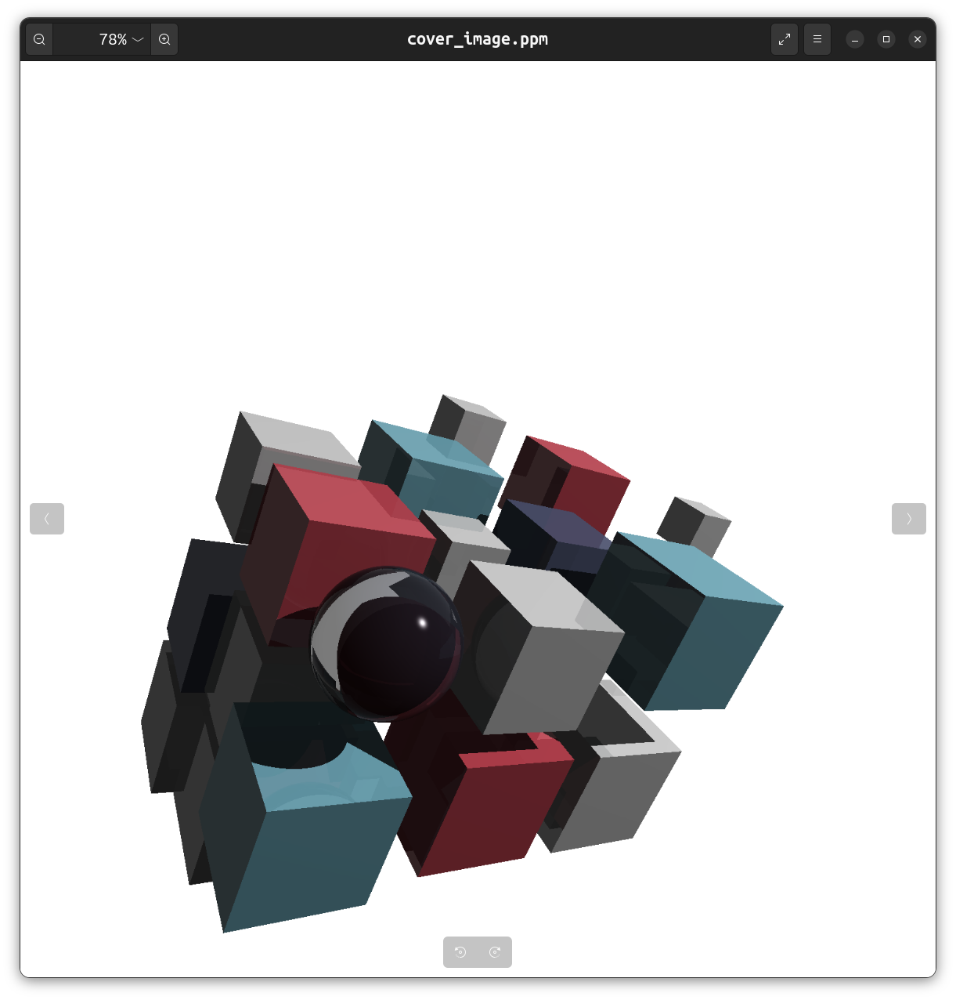

My attempt at Ray tracer using C++.

http://raytracerchallenge.com/

Very cool book. Would recommend 10/10.

Note: The world render examples at end of chapters are generated code using LLM, while the API and tests are handwritten. 
